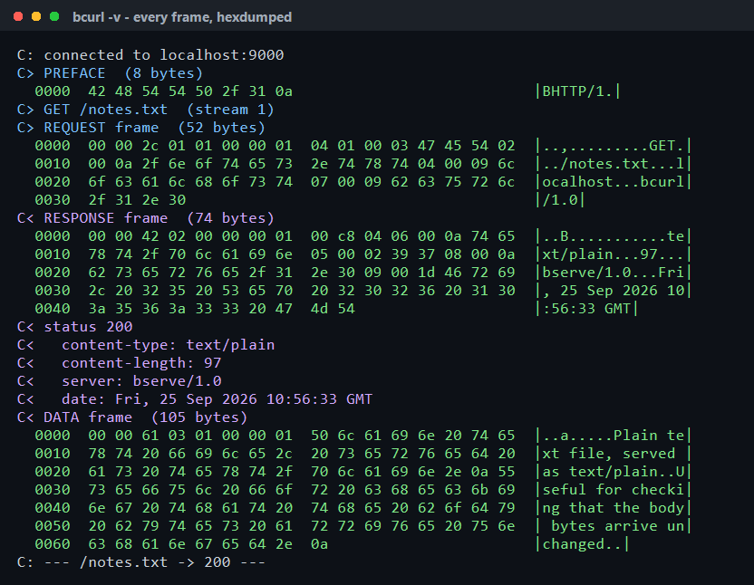
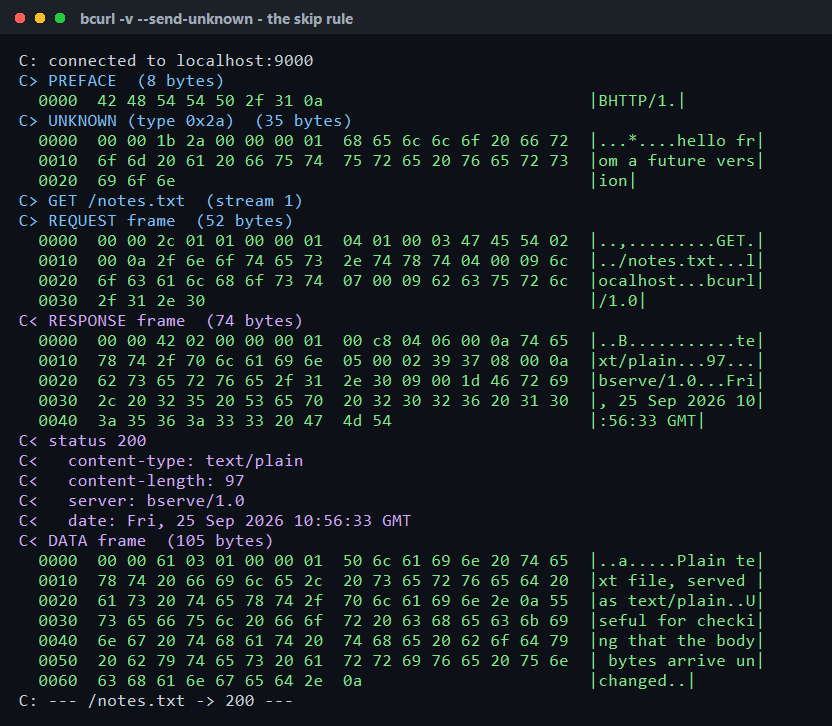

# Annotated hexdump — one complete request and response

Every byte below is real output, captured by running:

```
bin\bserve.exe www 9000
bin\bcurl.exe -v localhost:9000/notes.txt
```

`-v` makes `bcurl` hexdump every frame it sends and receives. `C>` means the
client sent it, `C<` means the client received it.



The file being fetched, `www/notes.txt`, is 97 bytes:

```
Plain text file, served as text/plain.
Useful for checking that the body bytes arrive unchanged.
```

Four things travel over the wire: a preface, a request frame, a response
frame, and a data frame. Here is every byte of all four.

---

## 1. The connection preface — 8 bytes

```
0000  42 48 54 54 50 2f 31 0a                           |BHTTP/1.|
```

| Bytes | Hex                        | Meaning                    |
|-------|----------------------------|----------------------------|
| 0–7   | `42 48 54 54 50 2f 31 0a`  | the ASCII text `BHTTP/1\n` |

Sent once, before any frame. The server reads 8 bytes and compares. If the
comparison fails it sends `GOAWAY` and hangs up — so a browser pointed at this
port is rejected immediately instead of being misread as a frame.

---

## 2. The REQUEST frame — 52 bytes

```
0000  00 00 2c 01 01 00 00 01  04 01 00 03 47 45 54 02  |..,.........GET.|
0010  00 0a 2f 6e 6f 74 65 73  2e 74 78 74 04 00 09 6c  |../notes.txt...l|
0020  6f 63 61 6c 68 6f 73 74  07 00 09 62 63 75 72 6c  |ocalhost...bcurl|
0030  2f 31 2e 30                                       |/1.0|
```

### 2a. The 8-byte frame header — bytes `0000`–`0007`

```
00 00 2c   01     01     00 00 01
\______/   \/     \/     \______/
 Length   Type  Flags   Stream ID
```

| Bytes  | Hex        | Field     | Value |
|--------|------------|-----------|-------|
| 0–2    | `00 00 2c` | Length    | `0x00002c` = **44** payload bytes follow |
| 3      | `01`       | Type      | **1 = REQUEST** |
| 4      | `01`       | Flags     | bit 0 set = **END_MSG**, this is the whole message |
| 5–7    | `00 00 01` | Stream ID | top bit reserved (0), id = **1** |

44 payload bytes + 8 header bytes = 52, which is the frame size `bcurl`
reported. The header is exactly the left half of the first dump line — that is
the 8-byte header paying off.

### 2b. The header block — bytes `0008`–`0033`

```
04                                   4 headers follow
```

**Header 1 — `:method: GET`**

```
01        NameID 1  -> ":method"  (from the table, not sent as text)
00 03     ValueLen = 3
47 45 54  "GET"
```

**Header 2 — `:path: /notes.txt`**

```
02                                   NameID 2  -> ":path"
00 0a                                ValueLen = 10
2f 6e 6f 74 65 73 2e 74 78 74        "/notes.txt"
```

**Header 3 — `host: localhost`**

```
04                                   NameID 4  -> "host"
00 09                                ValueLen = 9
6c 6f 63 61 6c 68 6f 73 74           "localhost"
```

**Header 4 — `user-agent: bcurl/1.0`**

```
07                                   NameID 7  -> "user-agent"
00 09                                ValueLen = 9
62 63 75 72 6c 2f 31 2e 30           "bcurl/1.0"
```

Adding up: `1 + (1+2+3) + (1+2+10) + (1+2+9) + (1+2+9)` = **44**. Matches the
Length field exactly.

Notice what is **not** on the wire: the strings `:method`, `:path`, `host` and
`user-agent` never appear. Four names, 32 characters of text, cost 4 bytes.
That is the first HPACK mechanism, and it is the whole of it.

---

## 3. The RESPONSE frame — 74 bytes

```
0000  00 00 42 02 00 00 00 01  00 c8 04 06 00 0a 74 65  |..B...........te|
0010  78 74 2f 70 6c 61 69 6e  05 00 02 39 37 08 00 0a  |xt/plain...97...|
0020  62 73 65 72 76 65 2f 31  2e 30 09 00 1d 46 72 69  |bserve/1.0...Fri|
0030  2c 20 32 35 20 53 65 70  20 32 30 32 36 20 31 30  |, 25 Sep 2026 10|
0040  3a 35 36 3a 33 33 20 47  4d 54                    |:56:33 GMT|
```

### 3a. The frame header — bytes `0000`–`0007`

| Bytes | Hex        | Field     | Value |
|-------|------------|-----------|-------|
| 0–2   | `00 00 42` | Length    | `0x42` = **66** payload bytes |
| 3     | `02`       | Type      | **2 = RESPONSE** |
| 4     | `00`       | Flags     | **0** — END_MSG is *not* set, so a body is coming |
| 5–7   | `00 00 01` | Stream ID | **1** — answering the request above |

The flags byte is the interesting one. It is `00`, which is the frame saying
"I am not the end of this message, keep reading."

### 3b. The status — bytes `0008`–`0009`

```
00 c8     =  200 decimal
```

Two bytes, big-endian. Not the characters `"200"` — there is nothing to parse
and no way to write it wrong.

### 3c. The header block — bytes `000a`–`0049`

```
04                                   4 headers follow
```

**`content-type: text/plain`**

```
06                                   NameID 6  -> "content-type"
00 0a                                ValueLen = 10
74 65 78 74 2f 70 6c 61 69 6e        "text/plain"
```

**`content-length: 97`**

```
05                                   NameID 5  -> "content-length"
00 02                                ValueLen = 2
39 37                                "97"
```

**`server: bserve/1.0`**

```
08                                   NameID 8  -> "server"
00 0a                                ValueLen = 10
62 73 65 72 76 65 2f 31 2e 30        "bserve/1.0"
```

**`date: Fri, 25 Sep 2026 10:56:33 GMT`**

```
09                                   NameID 9  -> "date"
00 1d                                ValueLen = 29
46 72 69 2c 20 ... 47 4d 54          "Fri, 25 Sep 2026 10:56:33 GMT"
```

Total: `2 (status) + 1 (count) + 13 + 5 + 13 + 32` = **66**. Matches Length.

---

## 4. The DATA frame — 105 bytes

```
0000  00 00 61 03 01 00 00 01  50 6c 61 69 6e 20 74 65  |..a.....Plain te|
0010  78 74 20 66 69 6c 65 2c  20 73 65 72 76 65 64 20  |xt file, served |
0020  61 73 20 74 65 78 74 2f  70 6c 61 69 6e 2e 0a 55  |as text/plain..U|
0030  73 65 66 75 6c 20 66 6f  72 20 63 68 65 63 6b 69  |seful for checki|
0040  6e 67 20 74 68 61 74 20  74 68 65 20 62 6f 64 79  |ng that the body|
0050  20 62 79 74 65 73 20 61  72 72 69 76 65 20 75 6e  | bytes arrive un|
0060  63 68 61 6e 67 65 64 2e  0a                       |changed..|
```

### 4a. The frame header — bytes `0000`–`0007`

| Bytes | Hex        | Field     | Value |
|-------|------------|-----------|-------|
| 0–2   | `00 00 61` | Length    | `0x61` = **97** — exactly the file size |
| 3     | `03`       | Type      | **3 = DATA** |
| 4     | `01`       | Flags     | **END_MSG** — the message ends here |
| 5–7   | `00 00 01` | Stream ID | **1** |

### 4b. The payload — bytes `0008`–`0068`

97 bytes of file, byte for byte, with nothing wrapped around them. No chunk
markers, no terminator, no escaping: the length in the header already said how
many bytes there are. The printable column on the right is the file.

`97` here equals the `content-length: 97` in the response header, which equals
the size of `www/notes.txt` on disk.

When `bcurl` sees `END_MSG` it stops reading, writes those 97 bytes to stdout
and returns 200. The TCP connection stays open.

---

## 5. Bonus: an unknown frame being skipped

Run with `--send-unknown`, the client sends a frame of type `0x2a` — a type
that does not exist in BHTTP/1 — before its request.



```
0000  00 00 1b 2a 00 00 00 01  68 65 6c 6c 6f 20 66 72  |...*....hello fr|
0010  6f 6d 20 61 20 66 75 74  75 72 65 20 76 65 72 73  |om a future vers|
0020  69 6f 6e                                          |ion|
```

| Bytes | Hex        | Field     | Value |
|-------|------------|-----------|-------|
| 0–2   | `00 00 1b` | Length    | `0x1b` = **27** |
| 3     | `2a`       | Type      | **0x2a — not a type this server knows** |
| 4     | `00`       | Flags     | 0 |
| 5–7   | `00 00 01` | Stream ID | 1 |

The server has never heard of type `0x2a`. It does not need to. Byte 0–2 told
it that 27 bytes follow, so it reads 27 bytes, discards them, logs one line,
and reads the next frame header — which lands exactly on the real request:

```
[conn 4] unknown frame type 0x2a, 27 bytes skipped
[conn 4] stream 1  GET /notes.txt
[conn 4]   200 www/notes.txt (97 bytes)
```

The request after it is served normally and `bcurl` exits 0. Nothing
desynchronised, nothing dropped. That is the skip rule doing the one job it
exists to do — and the reason a version 2 of this protocol is possible at all.
