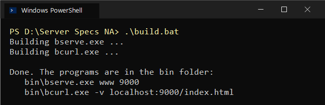
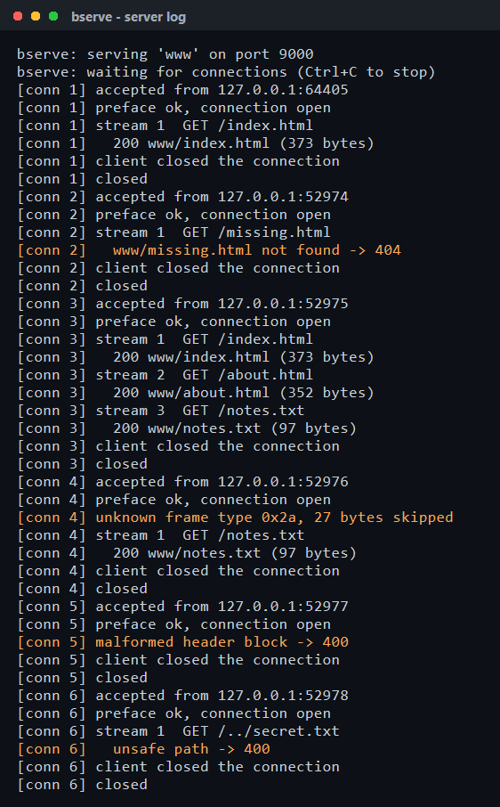
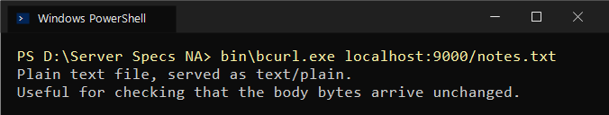
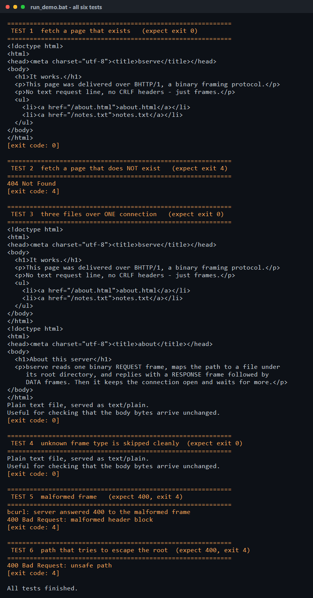

# Server Specs: BHTTP/1 — HTTP in binary, a small protocol, a server and a client

A course project in two tracks and one protocol.

* **Track 1 — the server.** `bserve` accepts a TCP connection, reads binary
  request frames, maps the path to a file under a root directory, replies with
  a status, headers and the bytes, and keeps the connection open.
* **Track 2 — the client.** `bcurl` builds the request frame, reads the
  response, writes the body to stdout, hexdumps every frame with `-v`, exits
  non-zero on 4xx/5xx, and never opens a second connection.
* **The bit in the middle** — the actual project — is [`SPEC.md`](SPEC.md):
  a fixed 8-byte frame header whose field widths are chosen and defended, ten
  numbered header names, and the rule that an unknown frame type must be
  skipped cleanly.

Written in C++17. About 900 lines. No libraries beyond the standard library
and the operating system's sockets.

### In simple words

* Normal websites talk in **text**. This project makes a small version of a
  website that talks in **bytes** (numbers) instead.
* **`bserve`** is the **server**. It sits and waits. When someone asks for a
  file, it finds the file in the `www` folder and sends it back.
* **`bcurl`** is the **client**. You give it a file name, it asks the server
  for it, and it prints what comes back.
* Every message is put in a small **box** called a **frame**. The first 8 bytes
  of the box say how big the box is and what is inside.
* If the server gets a box it does not understand, it **throws it away and
  keeps going**. This lets a newer version add new kinds of boxes later.
* All screenshots below are from **Windows**, in PowerShell.

---

## What is in this folder

| Path | What it is |
|------|------------|
| **`SPEC.md`** | **The protocol specification. Start here.** |
| **`HEXDUMP.md`** | **Every byte of one complete request and response, annotated.** |
| `src/frame.h` | The wire format, in code. The spec's twin. |
| `src/frame.cpp` | Building and parsing frames and header blocks. |
| `src/bserve.cpp` | The server. |
| `src/bcurl.cpp` | The client. |
| `src/net.h` | A small shim so one socket API works on Windows and Linux. |
| `www/` | The files the server serves. |
| `build.bat` / `Makefile` | Building on Windows / on Linux and macOS. |
| `run_demo.bat` | Runs all six test cases and prints the exit codes. |
| `docs/` | The captured terminal output and the screenshots below. |

---

## Building

You need a C++17 compiler. Everything else is already on your machine.

### Windows

```
build.bat
```

<p align="center">
  
</p>

> **What you see:** `build.bat` turns the code into two programs,
> `bserve.exe` and `bcurl.exe`, and puts them in the `bin` folder.

If `g++` is not found, install [MSYS2](https://www.msys2.org/), run
`pacman -S mingw-w64-ucrt-x86_64-gcc`, and add `C:\msys64\ucrt64\bin` to your
PATH. The build was done with g++ 15.2.0 and produces no warnings under
`-Wall -Wextra`.

### Linux and macOS

```
make
```

The only difference between the platforms is the library at the end of the
link line: `-lws2_32` for Winsock on Windows, `-pthread` everywhere else.
`src/net.h` handles the rest.

Both routes put `bserve` and `bcurl` in the `bin` folder.

---

## Running it

Open **two** terminals.

**Terminal 1 — start the server.** The arguments are the root directory and
the port:

```
bin\bserve.exe www 9000
```

It prints a line for every connection, request and reply:

<p align="center">
  
</p>

> **What you see:** the server is running on port 9000. Each `[conn N]` is
> one visitor. It shows what file they asked for and what it sent back
> (`200` = found, `404` = not found, `400` = bad request).

**Terminal 2 — fetch something:**

```
bin\bcurl.exe localhost:9000/index.html
```

<p align="center">
  
</p>

> **What you see:** the client asked for `notes.txt` and printed the file.
> That is all a normal fetch looks like.

The body goes to stdout, so redirecting to a file just works:

```
bin\bcurl.exe localhost:9000/index.html > saved.html
```

### `bcurl` options

| Option | What it does |
|--------|--------------|
| `-v` | Hexdump every frame sent and received, to stderr. |
| `--send-unknown` | Also send a frame of an unknown type, to prove the skip rule. |
| `--malformed` | Send a deliberately broken frame, to prove the server answers 400. |
| extra paths | Fetched over the **same** connection. |

### Exit codes

`bcurl` exits non-zero on 4xx and 5xx, so it can be used in a script.

| Code | Meaning |
|------|---------|
| 0 | every request returned 2xx |
| 4 | some request returned 4xx (404, 400, 405) |
| 5 | some request returned 5xx |
| 1 | could not connect, or the connection broke |
| 2 | bad command line |

---

## The tests

`run_demo.bat` runs all six cases against a server you have already started.

```
run_demo.bat
```

<p align="center">
  
</p>

> **What you see:** six checks, one after another. Each one ends with an
> **exit code**: `0` means it worked, `4` means the server said "no" (which
> is the right answer for a missing file, a broken message, or a path that
> tries to sneak out of the `www` folder). All six give the expected code.

| # | What it checks | Expected |
|---|----------------|----------|
| 1 | A page that exists | the HTML, exit **0** |
| 2 | A page that does not | `404 Not Found`, exit **4** |
| 3 | Three files over **one** connection | all three, exit **0** |
| 4 | An unknown frame type is skipped | the file still arrives, exit **0** |
| 5 | A malformed frame | `400`, exit **4** |
| 6 | A path with `..` in it | `400 unsafe path`, exit **4** |

Test 3 is the keep-alive requirement and the never-open-a-second-connection
requirement at once. The server log shows one connection serving three
requests with three different stream ids:

```
[conn 3] accepted from 127.0.0.1:52975
[conn 3] preface ok, connection open
[conn 3] stream 1  GET /index.html
[conn 3]   200 www/index.html (373 bytes)
[conn 3] stream 2  GET /about.html
[conn 3]   200 www/about.html (352 bytes)
[conn 3] stream 3  GET /notes.txt
[conn 3]   200 www/notes.txt (97 bytes)
[conn 3] client closed the connection
```

---

## Seeing the bytes

This is the part the spec is judged on, so it has its own document:
**[`HEXDUMP.md`](HEXDUMP.md)** walks through every byte of one complete
request and response.

```
bin\bcurl.exe -v localhost:9000/notes.txt
```

<p align="center">
  
</p>

> **What you see:** with `-v`, the client shows the **raw bytes** of every
> box. `C>` lines are what the client **sent**, `C<` lines are what it
> **got back**. The green numbers are the bytes, and the text on the right
> is the same bytes shown as letters.

Reading the first line of the request frame, `00 00 2c 01 01 00 00 01`:

```
00 00 2c   01     01     00 00 01
\______/   \/     \/     \______/
 length   type  flags    stream id
   44    REQUEST END_MSG     1
```

---

## The rule that may not be skipped

> A receiver meeting a frame type it does not know MUST skip it cleanly.

`--send-unknown` makes `bcurl` send a frame of type `0x2a`, which does not
exist in BHTTP/1, before the real request:

```
bin\bcurl.exe -v --send-unknown localhost:9000/notes.txt
```

<p align="center">
  
</p>

> **What you see:** the client first sends a box of a kind the server has
> never seen (`type 0x2a`). The server simply skips it, and the real
> request after it still works. The file arrives as normal.

The server has never heard of type `0x2a`. It does not have to — the length
field in the fixed header tells it how many bytes to throw away:

```
[conn 4] unknown frame type 0x2a, 27 bytes skipped
[conn 4] stream 1  GET /notes.txt
[conn 4]   200 www/notes.txt (97 bytes)
```

It skips 27 bytes, lands exactly on the next frame header, and serves the
request normally. `bcurl` exits 0. Nothing is desynchronised.

This works *only* because `Length` is in the fixed header and is mandatory for
every frame, including ones nobody has invented yet. That is the whole reason
the length comes first, and it is what leaves room for a version 2.

---

## How the code is arranged

```
        bcurl.cpp                     bserve.cpp
      (builds requests,              (serves files,
       prints bodies)                 keeps connections open)
            \                             /
             \                           /
              +--------- frame.cpp ------+      the wire format:
              |          frame.h         |      frames in, frames out
              +--------------------------+
                          |
                        net.h                   Winsock or BSD sockets
```

`frame.h` and `SPEC.md` describe the same thing, one for a compiler and one
for a person. Neither program contains any byte-level knowledge of its own:
if a field width changes, it changes in `frame.cpp` and nowhere else.

**Reading a frame is always the same three steps**, which is what makes the
skip rule easy to implement:

1. read 8 bytes
2. read the `Length` the header announced
3. decide what to do with the payload — including "nothing"

Step 3 is the only step that cares about the frame type. Steps 1 and 2 work
for every frame that will ever exist.

---

## Notes on two decisions that cost me time

**The status code is a 16-bit number, not the text `"200"`.** It is fixed
width, needs no parsing, and cannot be typed wrong. Everything in the frame
header follows the same principle: nothing on the wire has to be scanned for
a delimiter, because a length or a fixed width always says where it ends.

**`R_OK` is a trap.** The read-result enum was originally `R_OK`, `R_CLOSED`,
`R_IO`. It compiled and then behaved impossibly: the caller received 0 and
still took the error branch. `<io.h>` on Windows — and `<unistd.h>` on Linux —
define `R_OK` as a macro meaning 4, for `access()`. The preprocessor had
quietly rewritten `r != R_OK` into `r != 4` in one file and not the other.
The values are now `FRAME_OK`, `FRAME_CLOSED`, `FRAME_IO_ERROR`,
`FRAME_TOO_BIG`, and `src/frame.h` says why.

---

## What is deliberately missing

No multiplexing, flow control, compression, TLS, server push, or a dynamic
header table. Those are what a version 2 would add, and the skip rule in
[`SPEC.md` §6](SPEC.md) is the hook it would hang from.
